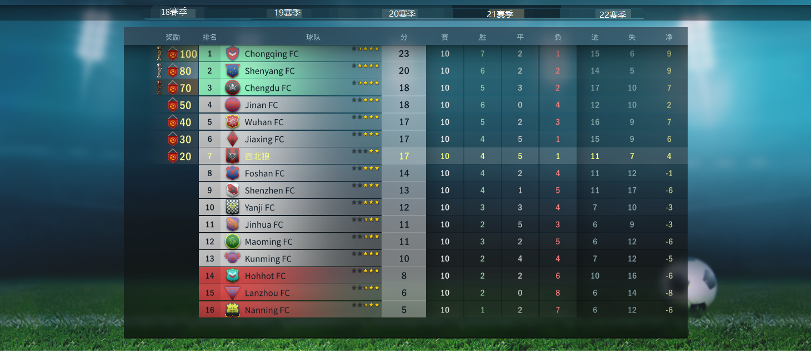
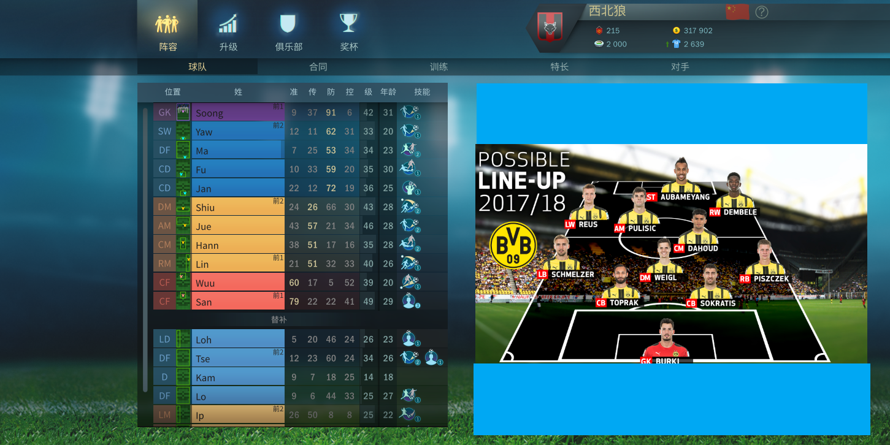
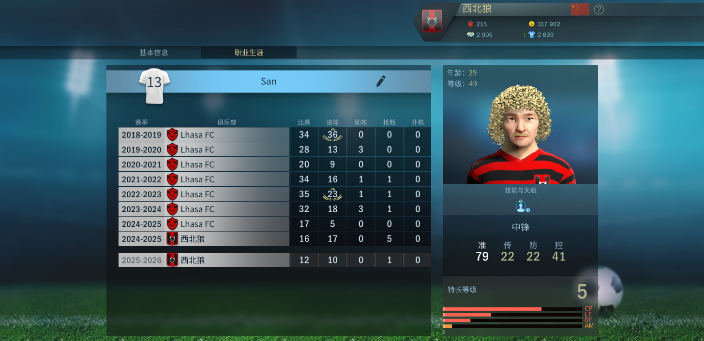
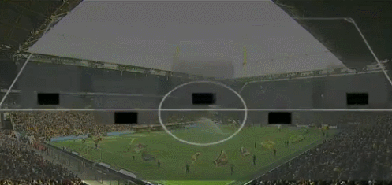

# 最不职业足球联赛网站生成器 - 指导方案

静态博客驱动，免费部署在github等，部署和更新傻瓜，没有数据库（业余联赛至多数十个球队，数百个球员，排序筛选等数据操作都发生在前端即可）

适合大学院系杯，院系内部班级比赛，或其他地区业余联赛使用

非常适合交给[东南大学小猴偷米工作室](https://github.com/HeraldStudio)开发。它甚至可以成为一个成熟的开源项目被很多业余联赛组织使用（多语言i18n支持，准备好了吗）

### 网站结构

* 联赛主页（支持多个赛季）
    * 一些静态的描述性页面，如联赛历史，规则等
* 积分榜
    * 其他球员数据榜可选
    * 
* 球队阵容
    * 包含球员数据照片，球队阵容，队徽，历史荣誉等
    * 
    * 
    * 甚至可以想象德甲转播首发阵容那样的gif小头像
    * 
* 赛程对阵

### 数据组织

* 简单版
    * 每个页面对应一个md或txt，更新数据即可
* 进阶版
    * 引入一些数据预处理pipeline，使得数据更新数量最少，且每处更新唯一。比如只更新每每场比赛一个txt，预处理会将进球，胜负积分等叠加到积分榜，球队主页等其他关联数据文件中。

### 主要技术

* Html, CSS, JS
* 静态博客技术(Jekyll, Hexo)
* 一些简单数据pipeline脚本(NodeJS, Python)

赛季开始时组织者可令各球队收集球员数据，照片等按格式提交。
每轮结束后只要更新格式化的文本文件中的数据即可。

* Image credit: Football, Tactics & Glory; Bundesliga;